# Práctica: Certificados digitales. HTTPS

## Certificado digital de persona física
#### Tarea 1: Instalación del certificado
1. Una vez que hayas obtenido tu certificado, explica brevemente como se instala en tu navegador favorito.

A través de un correo se descarga el certificado de Persona Física. Debe realizarse desde el mismo navegador desde el que se hizo la petición de obtención del certificado. 

2. Muestra una captura de pantalla donde se vea las preferencias del navegador donde se ve instalado tu certificado.

3. ¿Cómo puedes hacer una copia de tu certificado?, ¿Como vas a realizar la copia de seguridad de tu certificado?. Razona la respuesta.

Instalación del certificado digital en Firefox:
- En el menú de opciones: **Preferencias** > **Privacidad y seguridad** > **Seguridad** > **Certificados**. 
- Selecciona **Ver certificados**.
- En **Sus Certificados** selecciona **Hacer copia**.

De esta forma se realiza una copia del certificado digital. Y se introduce en un dispositivo externo para tener la copia. 

4. Investiga como exportar la clave pública de tu certificado.
En **Preferencias** > **Privacidad y seguridad** > **Seguridad** > **Certificados** > **Ver certificados** hacemos doble click sobre el certificado para que aparezca el visor de certificados. En la pestaña **Detalles** da la opción de **Exportar...**.
~~~
sudo openssl pkcs12 -in certificadoFNMT.p12 -clcerts -nokeys -out cert-PalomaR.pub.pem
~~~

#### Tarea 2: Validación del certificado
1. Instala en tu ordenador el software autofirma y desde la página de VALIDe valida tu certificado. Muestra capturas de pantalla donde se comprueba la validación.

Descarga el software desde [Firma electrónica gob](https://firmaelectronica.gob.es/Home/Descargas.html) o con el siguiente comando:
~~~
paloma@coatlicue:~$ wget https://estaticos.redsara.es/comunes/autofirma/currentversion/AutoFirma_Linux.zip
~~~

Pero antes, ya que es necesario un paquete de java, hay que instalar los siquientes paquetes:
~~~
paloma@coatlicue:~$ sudo apt-get install default-jre
paloma@coatlicue:~$ sudo apt-get install default-jdk
~~~

Una vez instalados los paquetes y descargada la herramienta necesaria:
~~~
paloma@coatlicue:~$ unzip AutoFirma_Linux.zip 
paloma@coatlicue:~$ sudo apt install libnss3-tools
paloma@coatlicue:~$ sudo dpkg -i AutoFirma_1_6_5.deb
~~~

En [VALIDe](https://valide.redsara.es) se valida el certificado seleccionando la opción AutoFirma:

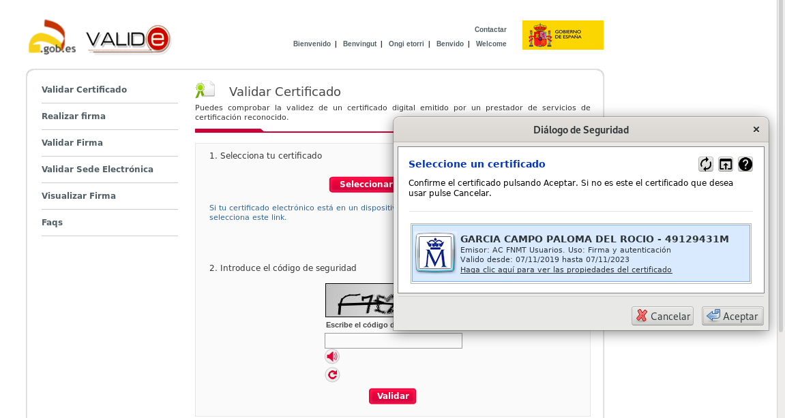
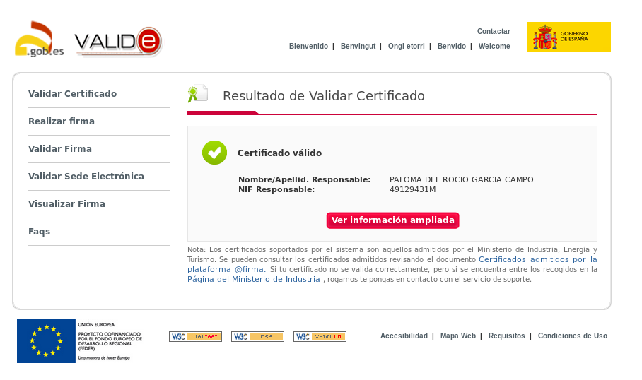

#### Tarea 3: Firma electrónica
1. Utilizando la página VALIDe y el programa autofirma, firma un documento con tu certificado y envíalo por correo a un compañero.

En la página del ejercicio anterior se selecciona la pestaña **Realizar firma** y el botón **Firmar**. De nuevo se selecciona AutoFirma y se elige el fichero que se quiere firmar y el certificado que anteriormente se ha validado. 
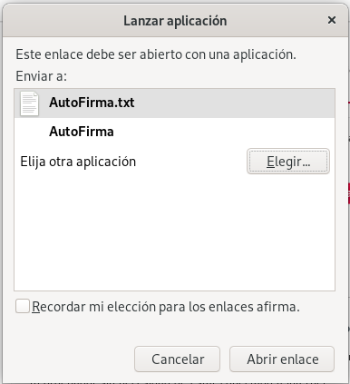
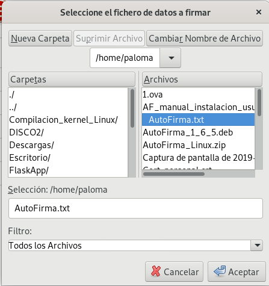
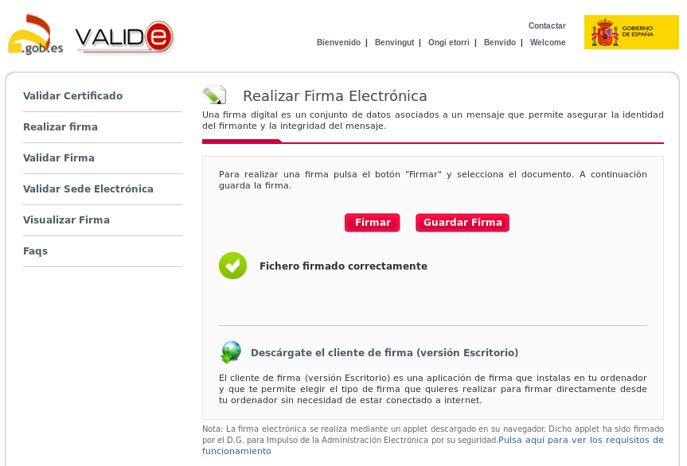

2. Tu debes recibir otro documento firmado por un compañero y utilizando las herramientas anteriores debes visualizar la firma (Visualizar Firma) y (Verificar Firma). ¿Puedes verificar la firma aunque no tengas la clave pública de tu compañero?, ¿Es necesario estar conectado a internet para hacer la validación de la firma?. Razona tus respuestas.

Para visualizar la firma del compañero hay que seleccionar Visualizar Firma.
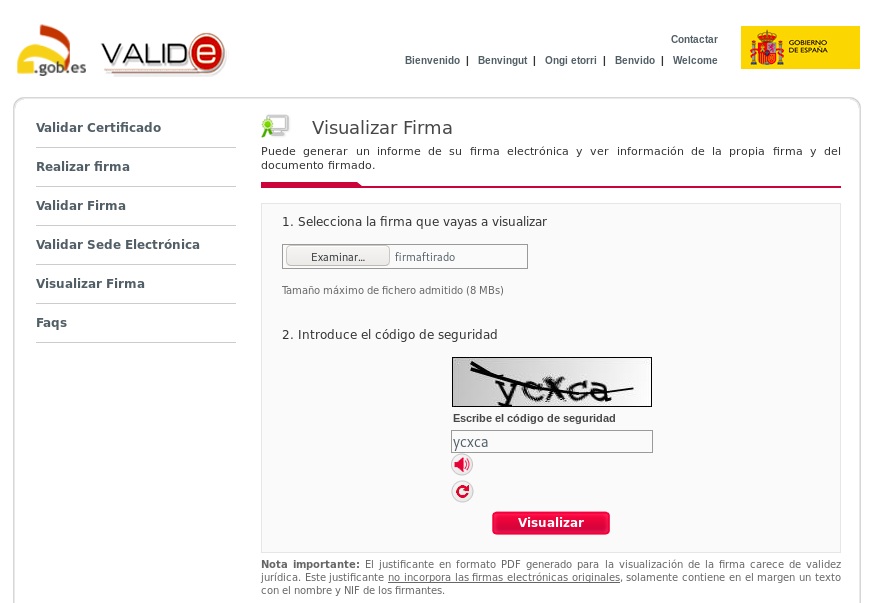

Para validar la firma del compañero hay que seleccionar Validar Firma.
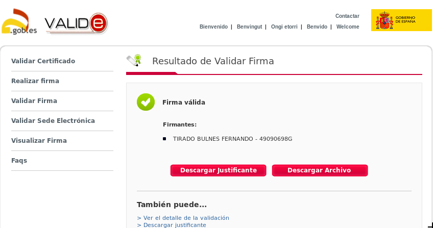

3. Entre dos compañeros, firmar los dos un documento, verificar la firma para comprobar que está firmado por los dos.

Con la aplicación AutoFirma se selecciona el documento del compañero y se firma.

#### Tarea 4: Autentificación
1. Utilizando tu certificado accede a alguna página de la administración pública )cita médica, becas, puntos del carnet,…). Entrega capturas de pantalla donde se demuestre el acceso a ellas.
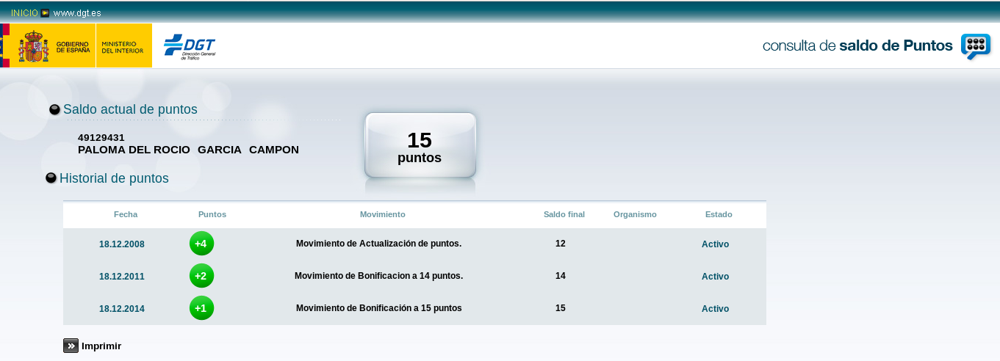

## HTTPS / SSL
Antes de hacer esta práctica vamos a crear una página web (puedes usar una página estática o instalar una aplicación web) en un servidor web apache2 que se acceda con el nombre tunombre.iesgn.org.
sudo cp 000-default.conf paloma.iesgn.org
~~~
<VirtualHost *:80>

        ServerAdmin webmaster@localhost
        DocumentRoot /var/www/html/paloma
~~~

#### Tarea 1: Certificado autofirmado
Esta práctica la vamos a realizar con un compañero. En un primer momento un alumno creará una Autoridad Certficadora y firmará un certificado para la página del otro alumno. Posteriormente se volverá a realizar la práctica con los roles cambiados.

El alumno que hace de Autoridad Certificadora deberá entregar una documentación donde explique los siguientes puntos:

1. Crear su autoridad certificadora (generar el certificado digital de la CA).
Como root, se crea un escenario donde trabajar:
~~~
root@servidor:/home/vagrant# mkdir /root/ca
root@servidor:/home/vagrant# cd /root/ca/
root@servidor:~/ca# mkdir certs crl newcerts private
root@servidor:~/ca# chmod 700 private
root@servidor:~/ca# echo 1000 > serial
root@servidor:~/ca# touch openssl.cnf
~~~

Se modifica el fichero openssl.cnf:
~~~
# OpenSSL root CA configuration file.
# Copy to `/root/ca/openssl.cnf`.

[ ca ]
# `man ca`
default_ca = CA_default

[ CA_default ]
# Directory and file locations.
dir               = /root/ca
certs             = $dir/certs
crl_dir           = $dir/crl
new_certs_dir     = $dir/newcerts
database          = $dir/index.txt
serial            = $dir/serial
RANDFILE          = $dir/private/.rand

# The root key and root certificate.
private_key       = $dir/private/ca.key.pem
certificate       = $dir/certs/ca.cert.pem

# For certificate revocation lists.
crlnumber         = $dir/crlnumber
crl               = $dir/crl/ca.crl.pem
crl_extensions    = crl_ext
default_crl_days  = 30

# SHA-1 is deprecated, so use SHA-2 instead.
default_md        = sha256

name_opt          = ca_default
cert_opt          = ca_default
default_days      = 375
preserve          = no
policy            = policy_strict

[ policy_strict ]
# The root CA should only sign intermediate certificates that match.
# See the POLICY FORMAT section of `man ca`.
countryName             = match
stateOrProvinceName     = match
organizationName        = match
organizationalUnitName  = optional
commonName              = supplied
emailAddress            = optional

[ policy_loose ]
# Allow the intermediate CA to sign a more diverse range of certificates.
# See the POLICY FORMAT section of the `ca` man page.
countryName             = optional
stateOrProvinceName     = optional
localityName            = optional
organizationName        = optional
organizationalUnitName  = optional
commonName              = supplied
emailAddress            = optional

[ req ]
# Options for the `req` tool (`man req`).
default_bits        = 2048
distinguished_name  = req_distinguished_name
string_mask         = utf8only

# SHA-1 is deprecated, so use SHA-2 instead.
default_md          = sha256

# Extension to add when the -x509 option is used.
x509_extensions     = v3_ca

[ req_distinguished_name ]
# See <https://en.wikipedia.org/wiki/Certificate_signing_request>.
countryName                     = Country Name (2 letter code)
stateOrProvinceName             = State or Province Name
localityName                    = Locality Name
0.organizationName              = Organization Name
organizationalUnitName          = Organizational Unit Name
commonName                      = Common Name
emailAddress                    = Email Address

# Optionally, specify some defaults.
countryName_default             = ES
stateOrProvinceName_default     = Sevilla
localityName_default            = Dos Hermanas
0.organizationName_default      = PALOMA R. ENTIDAD CERTIFICADORA
organizationalUnitName_default  = PALOMA R.
emailAddress_default            = palomagaricacampon08@gmail.com

[ v3_ca ]
# Extensions for a typical CA (`man x509v3_config`).
subjectKeyIdentifier = hash
authorityKeyIdentifier = keyid:always,issuer
basicConstraints = critical, CA:true
keyUsage = critical, digitalSignature, cRLSign, keyCertSign

[ v3_intermediate_ca ]
# Extensions for a typical intermediate CA (`man x509v3_config`).
subjectKeyIdentifier = hash
authorityKeyIdentifier = keyid:always,issuer
basicConstraints = critical, CA:true, pathlen:0
keyUsage = critical, digitalSignature, cRLSign, keyCertSign

[ usr_cert ]
# Extensions for client certificates (`man x509v3_config`).
basicConstraints = CA:FALSE
nsCertType = client, email
nsComment = "OpenSSL Generated Client Certificate" 
subjectKeyIdentifier = hash
authorityKeyIdentifier = keyid,issuer
keyUsage = critical, nonRepudiation, digitalSignature, keyEncipherment
extendedKeyUsage = clientAuth, emailProtection

[ server_cert ]
# Extensions for server certificates (`man x509v3_config`).
basicConstraints = CA:FALSE
nsCertType = server
nsComment = "OpenSSL Generated Server Certificate" 
subjectKeyIdentifier = hash
authorityKeyIdentifier = keyid,issuer:always
keyUsage = critical, digitalSignature, keyEncipherment
extendedKeyUsage = serverAuth

[ crl_ext ]
# Extension for CRLs (`man x509v3_config`).
authorityKeyIdentifier=keyid:always

[ ocsp ]
# Extension for OCSP signing certificates (`man ocsp`).
basicConstraints = CA:FALSE
subjectKeyIdentifier = hash
authorityKeyIdentifier = keyid,issuer
keyUsage = critical, digitalSignature
extendedKeyUsage = critical, OCSPSigning
~~~

Se crea la llave de la entidad:
~~~
root@servidor:~/ca# openssl genrsa -aes256 -out private/ca.key.pem 4096
Generating RSA private key, 4096 bit long modulus (2 primes)
............................................................................................................................................................................................................................................................................................++++
..........................................................................++++
e is 65537 (0x010001)
Enter pass phrase for private/ca.key.pem:
Verifying - Enter pass phrase for private/ca.key.pem:
~~~

Y se cambian los permisos:
~~~
root@servidor:~/ca# chmod 400 private/ca.key.pem 
~~~

Se crea el certificado de la entidad certificadora:
~~~
root@servidor:~/ca# openssl req -config openssl.cnf \
> -key private/ca.key.pem \
> -new -x509 -days 7300 -sha256 -extensions v3_ca \
> -out certs/ca.cert.pem
Enter pass phrase for private/ca.key.pem:
You are about to be asked to enter information that will be incorporated
into your certificate request.
What you are about to enter is what is called a Distinguished Name or a DN.
There are quite a few fields but you can leave some blank
For some fields there will be a default value,
If you enter '.', the field will be left blank.
-----
Country Name (2 letter code) [ES]:
State or Province Name [Sevilla]:
Locality Name [Dos Hermanas]:
Organization Name [PALOMA R. ENTIDAD CERTIFICADORA]:
Organizational Unit Name [PALOMA R.]:
Common Name []:PalomaAC
Email Address [palomagaricacampon08@gmail.com]: 
~~~

Se cambian los permisos del certificado:
~~~
root@servidor:~/ca# chmod 444 certs/ca.cert.pem
~~~

Y se verifica:
~~~
root@servidor:~/ca# openssl x509 -noout -text -in certs/ca.cert.pem
Certificate:
    Data:
        Version: 3 (0x2)
        Serial Number:
            71:32:69:fc:42:12:f3:ac:0a:b2:8a:19:3c:d5:60:00:22:5a:16:d2
        Signature Algorithm: sha256WithRSAEncryption
        Issuer: C = ES, ST = Sevilla, L = Dos Hermanas, O = PALOMA R. ENTIDAD CERTIFICADORA, OU = PALOMA R., CN = PalomaAC, emailAddress = palomagaricacampon08@gmail.com
        Validity
            Not Before: Nov 11 10:07:26 2019 GMT
            Not After : Nov  6 10:07:26 2039 GMT
        Subject: C = ES, ST = Sevilla, L = Dos Hermanas, O = PALOMA R. ENTIDAD CERTIFICADORA, OU = PALOMA R., CN = PalomaAC, emailAddress = palomagaricacampon08@gmail.com
        Subject Public Key Info:
            Public Key Algorithm: rsaEncryption
                RSA Public-Key: (4096 bit)
                Modulus:
                    00:bb:8e:30:0e:6b:17:80:ff:d9:e0:48:3b:6c:07:
                    82:e0:58:50:b9:c4:9c:37:a1:28:a8:72:2c:65:f8:
                    36:ac:d2:c5:62:bb:55:92:8e:8e:49:50:47:7c:a4:
                    5a:73:1c:ad:f4:55:17:ab:2f:5b:11:3c:80:95:93:
                    2c:6f:a0:b5:8d:35:9a:bd:3f:85:0e:34:46:5c:e9:
                    37:e3:12:3d:07:a7:3d:67:bb:cb:5f:e1:38:d2:74:
                    e6:63:d0:3f:da:b2:55:51:8e:48:ca:85:6a:bf:2f:
                    35:e4:e8:20:1e:0c:43:49:67:27:4e:93:ac:13:13:
                    9b:56:89:b3:eb:af:44:e2:48:79:0d:a6:41:e7:ed:
                    a8:12:99:79:d8:2c:2e:00:13:43:c9:85:95:66:5e:
                    21:5b:3d:91:56:6f:23:4e:45:dd:ee:28:66:42:d0:
                    86:f3:ba:51:98:2c:1a:8b:09:1e:e9:f4:df:0c:cb:
                    8c:a0:78:50:3b:ef:55:b0:de:9e:de:c8:68:d6:2e:
                    7a:d7:85:0d:b4:7d:6e:06:db:3c:32:e0:44:88:12:
                    d3:b1:ce:82:61:57:18:92:45:5b:0a:1f:3a:8e:3d:
                    24:e8:e8:ec:ba:76:51:81:c9:cf:19:d4:ec:81:83:
                    49:09:02:bd:d5:c6:bc:ea:7b:7f:40:54:86:c9:db:
                    02:fd:a2:98:a8:34:d4:ea:ef:d5:71:4b:a7:64:23:
                    90:c8:fa:ca:dd:d4:91:e4:90:0e:2d:1d:d3:6d:b6:
                    a5:0d:98:ed:14:78:02:6d:5b:6b:2f:ae:ec:1f:9d:
                    ac:f2:b7:c9:aa:b9:22:d7:3e:a0:20:35:b4:12:c0:
                    9d:5a:08:22:8b:99:6b:45:df:09:42:0e:ad:34:b1:
                    a4:9e:46:00:22:27:e2:c2:7e:31:7c:0a:0f:7c:57:
                    81:49:cb:71:93:fa:33:18:7d:1a:98:8c:b1:0f:ea:
                    2e:0a:72:b0:b8:12:3d:75:d8:74:b2:00:b6:dd:a6:
                    44:4c:cb:44:4e:8d:1e:08:57:6b:d0:ee:6b:d0:a9:
                    49:64:f8:87:b3:2a:f8:90:da:49:c1:42:77:ef:fd:
                    f2:c3:41:07:f6:e6:02:1a:21:f1:c4:79:4d:d4:07:
                    4f:fd:45:04:4a:a6:d4:d7:a4:95:a9:40:5c:c9:69:
                    a8:b8:6b:5c:2d:a5:b4:eb:02:79:39:96:84:78:df:
                    c1:b7:7f:26:74:d2:72:78:b2:18:2a:be:2d:64:57:
                    15:ce:6a:9a:df:0f:b4:47:f3:92:75:34:ec:d0:56:
                    43:f3:66:73:ca:cf:65:10:9f:cd:52:4b:bc:17:4c:
                    47:e2:7e:dd:20:cd:38:ad:ad:ca:61:74:8d:28:8b:
                    25:8c:e7
                Exponent: 65537 (0x10001)
        X509v3 extensions:
            X509v3 Subject Key Identifier: 
                6C:15:FB:C4:94:DF:64:FB:32:59:A7:F7:53:91:45:10:30:AE:0C:B5
            X509v3 Authority Key Identifier: 
                keyid:6C:15:FB:C4:94:DF:64:FB:32:59:A7:F7:53:91:45:10:30:AE:0C:B5

            X509v3 Basic Constraints: critical
                CA:TRUE
            X509v3 Key Usage: critical
                Digital Signature, Certificate Sign, CRL Sign
    Signature Algorithm: sha256WithRSAEncryption
         1d:a6:4e:94:80:f2:00:ed:9c:e1:e0:62:d3:e3:c3:fa:6e:6b:
         03:c5:7d:18:b4:17:fb:9b:47:c8:48:0f:d2:f4:83:4b:8e:ad:
         5c:90:ab:0f:a3:11:e6:74:57:67:e5:52:34:a2:26:6a:70:f8:
         71:af:c2:e5:57:bc:b9:fc:8b:9c:2c:69:73:42:5e:d7:5d:e3:
         ae:d9:7d:e0:e5:46:19:3c:b7:66:a2:7b:c4:62:23:17:73:df:
         eb:e2:ca:fa:41:d7:6e:17:5b:bb:84:68:ff:a2:ac:66:2e:fd:
         b9:7e:ff:2f:50:33:d0:18:87:68:0d:da:9b:32:fd:ee:70:85:
         65:bc:19:74:a3:5a:39:e0:67:c7:78:a8:ee:58:77:98:f5:f2:
         65:1b:b3:a6:07:33:e4:0f:93:8c:e1:55:cb:8f:77:af:07:1f:
         86:95:d2:be:23:7d:35:d7:92:a3:7b:bf:04:25:42:67:c2:86:
         b5:ed:b2:b4:45:b6:11:4b:4d:ad:3a:c2:b3:45:1b:ff:50:da:
         f8:a4:a3:c4:f9:fa:35:f0:ac:05:73:da:dd:b7:e7:7b:b6:9c:
         7f:09:b0:ec:a7:a2:93:93:5e:0e:8a:03:5d:a4:08:de:a9:9b:
         0f:2c:9d:4c:84:79:4f:f1:1b:64:37:db:45:bd:8d:22:57:18:
         79:87:c3:f0:04:b9:0a:ff:5a:4f:16:51:d1:3a:61:ce:ad:1f:
         65:78:0b:1e:3a:f8:6c:5a:67:ba:59:a6:cc:9a:1f:d5:00:a0:
         5a:61:43:8c:2d:e2:34:9f:ba:b3:3a:88:79:62:92:39:d7:3f:
         f8:da:3d:5e:c7:25:ff:89:b4:4f:f8:e5:9e:d0:ec:19:b5:08:
         0f:97:62:8c:fb:f9:95:0d:61:bf:16:7a:0a:f1:58:d3:3e:72:
         03:bb:aa:eb:60:d5:48:4b:19:52:f8:e5:f8:35:85:b6:8d:12:
         a1:54:28:38:8e:6c:3e:28:8d:63:e7:34:34:a6:bb:bf:cf:88:
         92:86:5f:1b:96:06:a4:11:14:9e:73:49:06:14:4c:7a:6e:ac:
         8d:7e:7e:f9:7b:aa:9a:1c:01:49:b8:d1:a6:4b:3c:7b:c9:f5:
         d1:e6:52:e1:b6:a7:71:87:a2:08:16:12:4a:b9:7a:13:74:62:
         47:f7:f6:55:33:ee:b4:ba:42:4e:84:41:55:0d:f7:83:d7:b5:
         a7:a2:13:2b:f7:f1:fa:2c:2d:d2:c8:01:7d:1b:af:98:47:b5:
         e9:14:25:07:21:32:58:2f:38:3a:cc:6b:d1:ec:77:4e:b1:aa:
         69:de:9d:ff:f6:6f:59:d5:80:f4:0e:56:b4:94:ab:c5:17:e8:
         f2:13:a9:19:bc:5a:f4:df
~~~

2. Debe recibir el fichero CSR (Solicitud de Firmar un Certificado) de su compañero, debe firmarlo y enviar el certificado generado a su compañero.
Tras recibir el certificado se firma de la siguiente forma:
~~~
root@servidor:/home/vagrant# openssl x509 -req -in /vagrant/alejandro.iesgn.org.csr -CA /root/ca/certs/ca.cert.pem -CAkey /root/ca/private/ca.key.pem -CAcreateserial -out alejandro.iesgn.org-firmado.crt
Signature ok
subject=C = SP, ST = Seville, L = Dos Hermanas, O = Alejandro, CN = alejandro.iesgn.org
Getting CA Private Key
Enter pass phrase for /root/ca/private/ca.key.pem:
~~~

3. ¿Qué otra información debe aportar a tu compañero para que éste configure de forma adecuada su servidor web con el certificado generado?
El certificado de la entidad certificadora.

> El alumno que hace de administrador del servidor web, debe entregar una documentación que describa los siguientes puntos:

1. Crea una clave privada RSA de 4096 bits para identificar el servidor.

2. Utiliza la clave anterior para generar un CSR, considerando que deseas acceder al servidor tanto con el FQDN (tunombre.iesgn.org) como con el nombre de host (implica el uso de las extensiones Alt Name).

Se crea la clave:
~~~
vagrant@servidor:~$ sudo openssl genrsa -out paloma.iesgn.org.key 4096
~~~

Se crea el fichero paloma.iesgn.org.conf y configura:
~~~
[ req ]
default_bits       = 4096
default_keyfile    = paloma.iesgn.org.key
distinguished_name = req_distinguished_name
req_extensions     = req_ext

[ req_distinguished_name ]
countryName                 = Country Name (2 letter code)
countryName_default         = sp
stateOrProvinceName         = State or Province Name (full name)
stateOrProvinceName_default = Seville
localityName                = Locality Name (eg, city)
localityName_default        = Dos Hermanas
organizationName            = Organization Name (eg, company)
organizationName_default    = paloma 
commonName                  = Common Name (e.g. server FQDN or YOUR name)
commonName_max              = 64

[ req_ext ]
subjectAltName = @alt_names

[alt_names]
DNS.1   = servidor
~~~

Y se crea el certificado llamando al fichero de configuración que se ha creado:
~~~
vagrant@servidor:~$ sudo openssl req -new -nodes -sha256 -config paloma.iesgn.org.conf -out paloma.iesgn.org.csr
Generating a RSA private key
.......................................................................................................................................................................................................................................................................++++
.............++++
writing new private key to 'paloma.iesgn.org.key'
-----
You are about to be asked to enter information that will be incorporated
into your certificate request.
What you are about to enter is what is called a Distinguished Name or a DN.
There are quite a few fields but you can leave some blank
For some fields there will be a default value,
If you enter '.', the field will be left blank.
-----
Country Name (2 letter code) [sp]:
State or Province Name (full name) [Seville]:
Locality Name (eg, city) [Dos Hermanas]:
Organization Name (eg, company) [paloma]:
Common Name (e.g. server FQDN or YOUR name) []:paloma.iesgn.org 
~~~

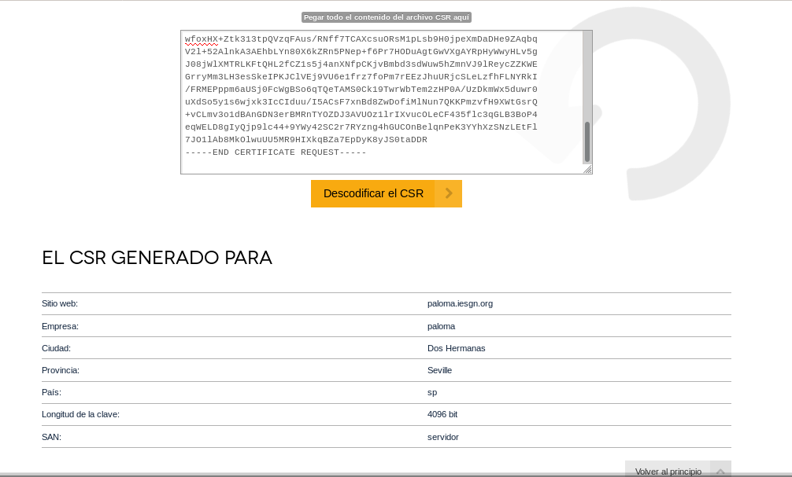

3. Envía la solicitud de firma a la entidad certificadora (su compañero).
Como este ejercicio se está realizando a través de máquinas virtuales en vagrant, vamos a enviar el fichero con el comando scp a la máquina anfitriona y de ahí a la máquina que actúa de entidad certificadora. 

4. Recibe como respuesta un certificado X.509 para el servidor firmado y el certificado de la autoridad certificadora.

5. Configura tu servidor web con https en el puerto 443, haciendo que las peticiones http se redireccionen a https (forzar https).
Se crea un nuevo fichero de configuración que lo hemos llamado paloma.iesgn.ssl.conf, que es una copia del fichero de configuración de nuestro sitio web, indicando la llave y los certificados:
~~~
<IfModule mod_ssl.c>
	<VirtualHost _default_:443>
		ServerAdmin webmaster@localhost
		ServerName paloma.iesgn.org
		DocumentRoot /var/www/html/paloma

		SSLEngine on

		SSLCertificateFile /etc/ssl/certs/paloma.iesgn.org-firmado.crt
		SSLCertificateKeyFile /etc/ssl/private/paloma.iesgn.org.key
		SSLCertificateChainFile /etc/ssl/certs/paloma.iesgn.org.csr

                ErrorLog ${APACHE_LOG_DIR}/error.log
                CustomLog ${APACHE_LOG_DIR}/access.log combined

	</VirtualHost>
</IfModule>
~~~

Se inicia apache con el nuevo .conf:
~~~
vagrant@servidor:~$ sudo a2enmod ssl
vagrant@servidor:~$ sudo a2ensite paloma.iesgn.ssl
Enabling site paloma.iesgn.ssl.
To activate the new configuration, you need to run:
  systemctl reload apache2
vagrant@servidor:~$ sudo systemctl restart apache2
~~~

Accedemos a la misma dirección que antes pero con https://
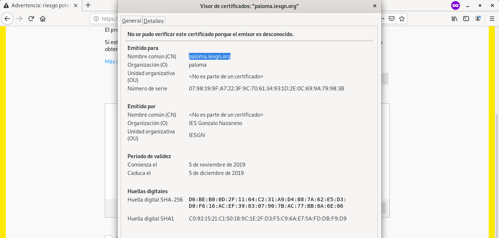

Se importa el certificado de la entidad autentificadora:
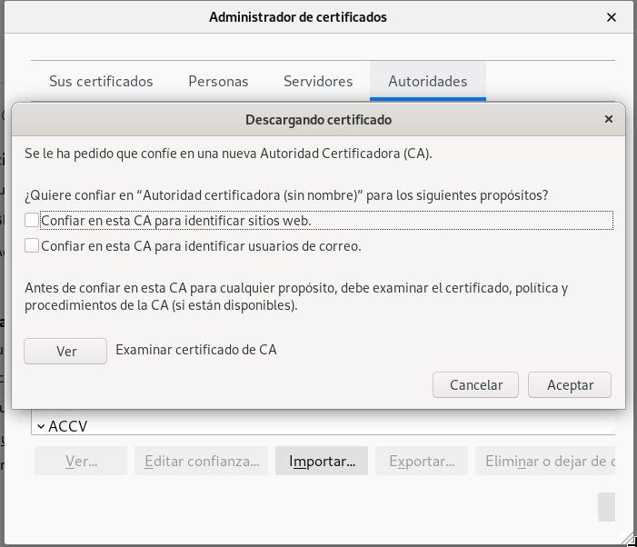

Con el certificado importado aparece ya la señal de conexión segura:

Se accede al fichero de configuración paloma.iesgn.conf apra realizar la redirección a https añadiendo las siguientes líneas:
~~~
        ServerName paloma.iesgn.org
        Redirect / https://paloma.iesgn.org
~~~

#### Tarea 2: Certificados digital con CAcert
El lema de CAcert es Free digital certificates for everyone y es que la utilización de certificados emitidos por CA comerciales no es posible para todos los sitios de Internet debido a su coste, lo que los limita su uso a transacciones económicas o sitios con datos relevantes. CAcert es una organización sin ánimo de lucro que mantiene una infraestructura equivalente a una CA comercial aunque con ciertas limitaciones.

Vamos a a crear un certificado para una página web que se llame www.tunombre.gonzalonazareno.org en el punto anterior para usar el nuevo certificado emitido por CAcert.

Los pasos que hay que dar para utilizar un certificado X.509 emitido por CAcert son los siguientes:

1. Darse de alta como usuario en el sitio web.
Para darse de alta hay que acceder a la página web de CAcert: [Darse de alta en CAcert](https://www.cacert.org/index.php?id=1). Tras rellenar los datos hay que verificar el correo personal que hemos introducido a través de un correo que nos llegará. 

2. Dar de alta el dominio para el que queremos obtener el certificado. (opción Domains -> Add)
Se accedemos de nuevo al sitio web de CAcert y se inicia sesión con la cuenta que ya se ha verificado. Hay que seleccionar el apartado **Dominios**>**Agregar** y poner el dominio correspondiente.

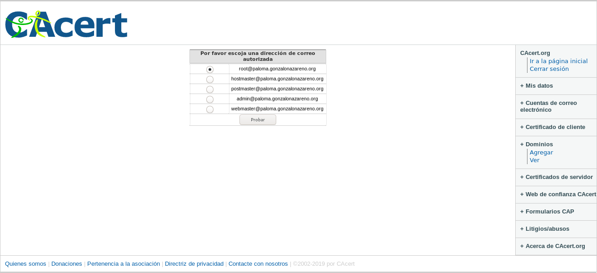

3. CAcert verifica que podemos hacer uso legítimo del dominio enviando un mensaje de correo electrónico. (Que recibirá y contestará el profesor!!!)
Cacert envía un correo al dominio, en este caso gonzalonazareno.org, el cual hay que verificar y tras esto, aparece verificado en **Dominios**>**Ver**.

4. Dar de alta el certificado de un servidor mediante una solicitud de firma certificado (CSR).
Se crea la clave privada:
~~~
vagrant@servidor:~$ sudo openssl genrsa -out paloma.gonzalonazareno.org.key 4096
~~~
Se crea un fichero de configuración para el certificado:
~~~
[ req ]
default_bits       = 4096
default_keyfile    = paloma.gonzalonazareno.org.key
distinguished_name = req_distinguished_name
req_extensions     = req_ext

[ req_distinguished_name ]
countryName                 = Country Name (2 letter code)
countryName_default         = sp
stateOrProvinceName         = State or Province Name (full name)
stateOrProvinceName_default = Seville
localityName                = Locality Name (eg, city)
localityName_default        = Dos Hermanas
organizationName            = Organization Name (eg, company)
organizationName_default    = paloma
commonName                  = Common Name (e.g. server FQDN or YOUR name)
commonName_max              = 64

[ req_ext ]
subjectAltName = @alt_names

[alt_names]
DNS.1   = servidor
~~~

Y se crea el certificado:
~~~
vagrant@servidor:~$ sudo openssl req -new -nodes -sha256 -config paloma.gonzalonazareno.org.conf -out paloma.gonzalonazareno.org.csr
Generating a RSA private key
...........................................++++
..................................................++++
writing new private key to 'paloma.gonzalonazareno.org.key'
-----
You are about to be asked to enter information that will be incorporated
into your certificate request.
What you are about to enter is what is called a Distinguished Name or a DN.
There are quite a few fields but you can leave some blank
For some fields there will be a default value,
If you enter '.', the field will be left blank.
-----
Country Name (2 letter code) [sp]:
State or Province Name (full name) [Seville]:
Locality Name (eg, city) [Dos Hermanas]:
Organization Name (eg, company) [paloma]:
Common Name (e.g. server FQDN or YOUR name) []:paloma.gonzalonazareno.org
~~~

Y se copia en la página de CAcert el csr:

Tras enviar la información del certificado, se crea un fichero .crt con el texto que nos devuelve CAcert:

5. Configurar el servidor web con el certificado X.509 emitido por la CA.

Tras mover todos los ficheros a su lugar correspondiente, se configura el fichero ssl.conf de apache de la siguiente forma:
~~~
<IfModule mod_ssl.c>
	<VirtualHost _default_:443>
		ServerAdmin webmaster@localhost

		DocumentRoot /var/www/html

		ErrorLog ${APACHE_LOG_DIR}/error.log
		CustomLog ${APACHE_LOG_DIR}/access.log combined

		SSLEngine on

		SSLCertificateFile	/etc/ssl/certs/paloma.gonzalonazareno.org.crt
		SSLCertificateKeyFile /etc/ssl/private/paloma.gonzalonazareno.org.key
		SSLCertificateChainFile /etc/ssl/certs/paloma.gonzalonazareno.org.csr

		<FilesMatch "\.(cgi|shtml|phtml|php)$">
				SSLOptions +StdEnvVars
		</FilesMatch>
		<Directory /usr/lib/cgi-bin>
				SSLOptions +StdEnvVars
		</Directory>

	</VirtualHost>
</IfModule>
~~~

Se inicia la nueva configuración de Apache2:
~~~
vagrant@servidor:~$ sudo a2enmod ssl
vagrant@servidor:~$ sudo a2ensite paloma.gonzalonazareno-ssl
Enabling site paloma.gonzalonazareno-ssl.
To activate the new configuration, you need to run:
  systemctl reload apache2
vagrant@servidor:~$ sudo systemctl restart apache2
~~~

6. Al acceder a la página debemos evitar el mensaje de error de “Conexión segura fallida”.
Al acceder a la página, aparece este mensaje.

Para evitarlo hay que agregar al navegador el certificado correspondiente que se ecuentra en la página [cacercrt](https://www.cacert.org/index.php?id=3) con el nombre **Certificado Raíz (Formato PEM)**. A continuación, aparece un mensaje preguntando si quiere confiar en la autoridad certificadora.

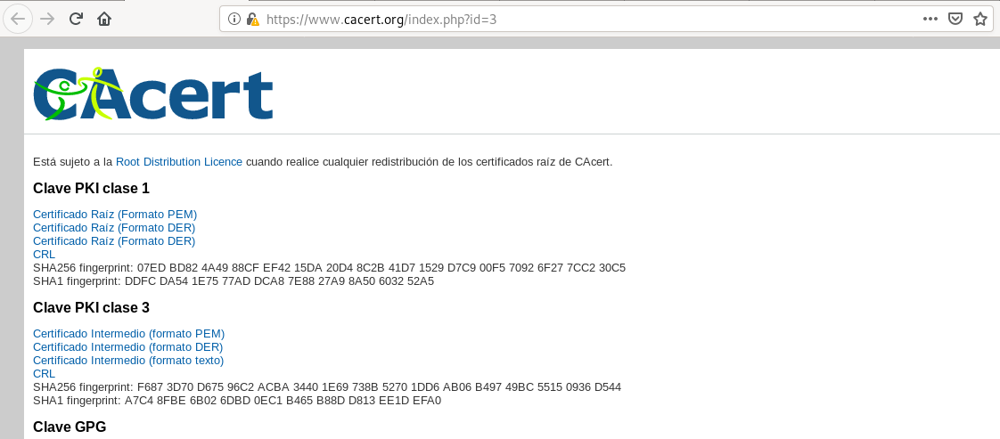

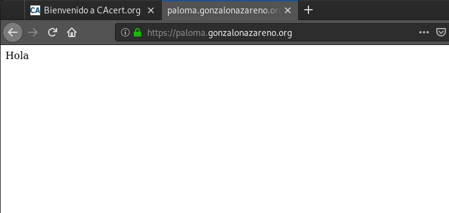

7. ¿Qué fecha de caducidad tiene el certificado? ¿Qué tendrás que hacer cuando termine ese tiempo?
La fecha es el 11 de mayo de 2020. Tendría que renovarlo.
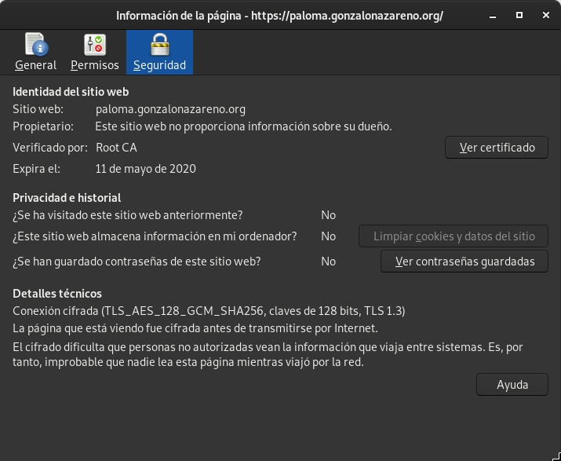

